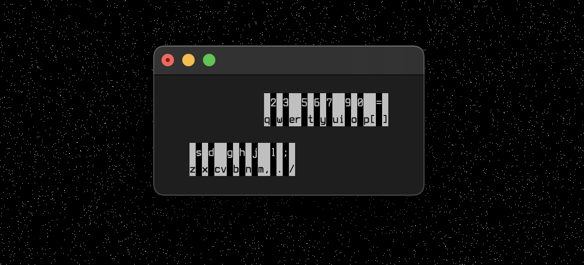

**SVMK** is a (Unix) terminal-based virtual MIDI keyboard for [SOUL Patches](https://github.com/soul-lang/SOUL/blob/master/docs/SOUL_Patch_Format.md).
- **Monophonic** because terminals don't reliably support keyup events
- Supports **hot-reloading** of SOUL Patches (just re-save the file)
- <kbd>ESC</kbd> to exit

`svmk path/to/patchfile.soulpatch`

## Installation:

1. Download the [`SOUL_PatchLoader DLL`](https://github.com/soul-lang/SOUL/releases/latest) and put it in a folder called `SOUL` inside your [`userApplicationDataDirectory`](https://docs.juce.com/master/classFile.html#a3e19cafabb03c5838160263a6e76313da0c9f89d8dc9f9f32c9eb42428385351d)
2. Download [`svmk`](https://github.com/maxwellpollack/svmk/releases/latest) and put it somewhere in your [`PATH`](https://en.wikipedia.org/wiki/PATH_(variable))

---

Credit to [this article by Lexi Summer Hale](http://xn--rpa.cc/irl/term.html) for convincing me to ditch `ncurses` :)
